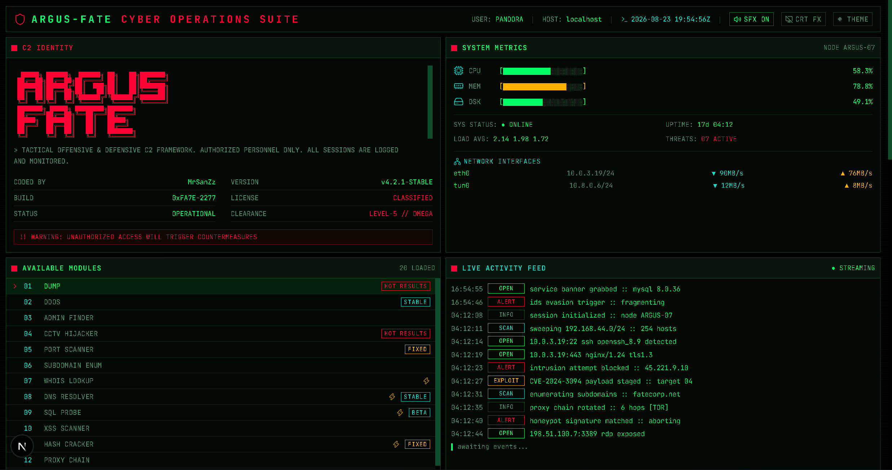

# 👁️ ARGUS-FATE // SUÍTE DE OPERAÇÕES CIBERNÉTICAS


**ARGUS-FATE** é um painel tático de Comando e Controle (C2) de alto nível, projetado para Inteligência de Fontes Abertas (OSINT) e auditoria de cibersegurança. O sistema conta com um terminal (CLI) web totalmente operacional, consultas de inteligência de ameaças em tempo real e uma interface imersiva de ficção científica com efeitos sonoros sintetizados via Web Audio.

## 🚀 Recursos Principais

* **📡 Motor OSINT Ativo:** Telemetria GeoIP em tempo real, resolução de ASN e enumeração de DNS.
* **🛡️ Auditoria de Segurança:** Inspeção automatizada de cabeçalhos de segurança HTTP (HSTS, CSP, X-Frame-Options) com algoritmo de pontuação (A+ até F).
* **🦠 Integração de Threat Intel:** Consulta ao vivo a bancos de dados globais de vulnerabilidades (NVD/CIRCL) para busca de CVEs.
* **🔊 Áudio Sci-Fi Sintetizado:** Bipes de digitação mecânica, radares e alarmes gerados 100% via código JavaScript usando Web Audio API (sem arquivos externos de áudio).
* **🎨 Temas Táticos & Efeitos CRT:** 4 paletas de cores de nível militar (Matrix Classic, Cyberpunk Amber, Deep Ops Cyan, Red Alert) com filtro de monitor CRT (scanlines) alternável.
* **🤖 Núcleo de IA PANDORA:** Assistente de inteligência artificial tática para recomendações defensivas e mitigação de exploits direto no terminal.
* **📄 Exportação Forense:** Gere e baixe instantaneamente um dossiê forense confidencial em markdown dos alvos auditados.

## 💻 Comandos Táticos do CLI

| Comando | Descrição |
|---|---|
| `recon <dominio\|ip>` | Varredura profunda OSINT (DNS, GeoIP, Cabeçalhos de Segurança & Pontuação) |
| `cve <termo\|id>` | Pesquisa no banco de dados global de ameaças CVE / NVD |
| `dns <dominio>` | Enumera registros DNS e analisa políticas SPF/DMARC |
| `headers <url>` | Audita cabeçalhos de segurança HTTP e postura do servidor |
| `hash <algo> <texto>` | Calcula hashes (sha256, sha512, md5) nativamente via Web Crypto API |
| `ai <pergunta>` | Consulta a IA Tática PANDORA para inteligência de defesa |
| `export [alvo]` | Baixa o dossiê de inteligência forense (relatório .md) |

## 🛠️ Instalação e Configuração

```bash
# Clone o repositório
git clone https://github.com/fabiopy-creator/argus-fate.git

# Acesse a pasta do projeto
cd argus-fate

# Instale as dependências
npm install

# Inicie o servidor tático
npm run dev
```

Acesse `http://localhost:3000` para entrar no terminal C2.

## 📸 Prévia da Interface
A interface conta com módulos interativos, um CLI integrado e mapas dinâmicos rastreando vetores de ataque.



---
*Criado por [fabiopy-creator](https://github.com/fabiopy-creator) — Apenas para fins educacionais e de auditoria defensiva.*
